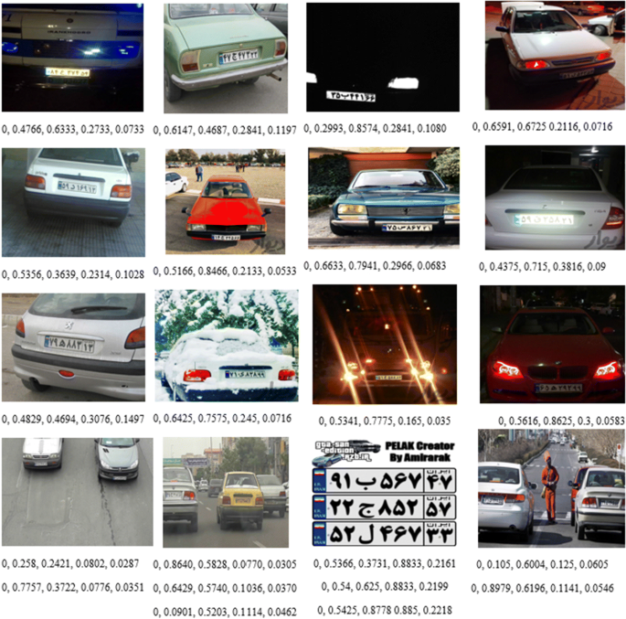

# Iranian license plate detection using YOLO8(ultralytics)




## Description

Using Yolo, we want to detect Iranian license plates. 
Applications of detecting car license plates :
1. Effective traffic law enforcement.
2. Vehicle theft prevention.
3. Journey time analysis.
4. Automatic parking management (Smart Parking)
5. Traffic management and traffic optimization.
6. Automated collection of tolls and toll booth records.


## How to install

``` 
pip install -r requirements.txt
```

## How to create a dataset

Collecting thousands of car photos from the internet and by yourself

## How to label photos

[Theos AI](https://theos.ai/?ref=https%3A%2F%2Fblog.theos.ai%2Farticles%2Flabelling-images-for-object-detection) 

 [Roboflow](https://roboflow.com/annotate)


 [Make Sense](https://www.makesense.ai/)


## How to train

We create a file with the yaml extension. Inside it, we save the dataset address, the train data address, and the validation data address along with the label number, for example, for the license plate number, we have considered zero, and train it.

## How to run

download the dataset and weights from  this [link :](https://drive.google.com/drive/folders/1jND-blvgIBYfGWLs_6eF-BvNrEnXHO4b?usp=drive_link)


```
jupyter nbconvert --execute --to notebook --inplace object_detection.ipynb
```


## result


